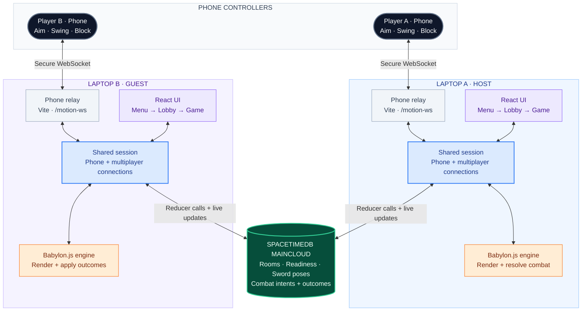

# Chambara

A browser-based sword-fighting prototype built with React, TypeScript, and Babylon.js. Phones act as motion controllers, while SpacetimeDB synchronizes multiplayer rooms, sword poses, combat intents, and host-resolved combat outcomes.

The repository contains the React game client in `game/`, the SpacetimeDB module in `spacetimedb/`, and source art in `assets/`.

## Requirements

- Node.js **22.12 or newer**, with a working npm installation.
- A modern desktop browser.
- For motion controls: a phone browser with motion/orientation sensor support and an HTTPS connection to the game.
- For backend development or publishing: the SpacetimeDB CLI. The backend was built and tested with version **2.10.1**.

The published Maincloud backend is already available. You do not need to run a local database to play.

## Quick start

From the project root:

```sh
cd game
npm install
npm run dev
```

Open the URL printed by Vite, usually `http://localhost:5173`. Keep this terminal running.

On Windows, run the same commands from PowerShell or Command Prompt at the repository root. If npm reports a missing `npm-cli.js`, repair the Node/npm installation or use an installed pnpm (`pnpm install`, then `pnpm run dev`).

## Play

Click the title screen to open the main menu:

- **Versus:** choose **Make lobby**, then share the six-character lobby code. The other player selects **Join lobby** and enters that code.
- **Practice:** choose **Dummy Training** to enter the dojo.
- **Settings:** open **Audio** to change music, sound effects, or mute. Escape returns to the previous menu.

For two players, run the game on each laptop. Each phone pairs with its own laptop; the laptops share the same Maincloud database and lobby code.

The lobby currently enters the game when both phones are ready **or after the opponent has been present for about two seconds**. Phone readiness is therefore not a strict start gate in this version.

### Connect a phone

In a second terminal in `game`, start an HTTPS tunnel:

```sh
# Windows
npm run tunnel-win

# macOS
npm run tunnel-mac
```

The helper uses `cloudflared`, downloading it into `game/.tools` on first use if necessary. Keep both the dev server and tunnel running.

1. Open the printed `https://...trycloudflare.com` URL on the laptop. This ensures its controller links use the reachable HTTPS address.
2. Scan that laptop's phone-controller QR code, or open its controller link on the phone.
3. Tap **Enable Motion** and allow sensor access.
4. Hold the phone screen-up with its top edge toward the monitor, then tap **Recenter**.
5. Tap **Ready for Match** when available.
6. Tilt to aim the guard, swing to slash, and hold **Hold to Block** to block.

The **lobby code** joins two laptops. The **phone room code** pairs a phone with one laptop. These are separate codes.

If Vite chooses another port, pass that port to the tunnel helper:

```sh
npm run tunnel-win -- -Port 5174
npm run tunnel-mac -- 5174
```

The temporary tunnel URL changes when restarted. Reopen the new URL and pair the phone again.

## Backend configuration

The frontend defaults to:

| Setting   | Value                                                                            |
| --------- | -------------------------------------------------------------------------------- |
| Server    | `https://maincloud.spacetimedb.com`                                              |
| Database  | `chambara-merged-20260920`                                                       |
| Dashboard | [Maincloud database dashboard](https://spacetimedb.com/chambara-merged-20260920) |

To override these defaults, create `game/.env`:

```dotenv
VITE_SPACETIME_URI=https://maincloud.spacetimedb.com
VITE_SPACETIME_DB=chambara-merged-20260920
```

Restart Vite after changing environment variables. Production builds capture these values at build time, so rebuild after changing them. `game/.env` is ignored by Git.

### Build or publish the backend

From the project root, install the server dependencies and build:

```sh
cd spacetimedb/spacetimedb
npm install
spacetime build
```

To update the published database, authenticate as its owner and publish from that same directory:

```sh
spacetime login
spacetime publish chambara-merged-20260920 --server https://maincloud.spacetimedb.com --module-path . --no-config --delete-data=never
```

This targets the existing shared database and preserves its data. The project publish configuration in `spacetimedb/spacetime.json` and `spacetimedb/spacetime.local.json` also points to this database.

After changing the server schema, regenerate the client bindings from the **project root**:

```sh
spacetime generate --lang typescript --module-path spacetimedb/spacetimedb --out-dir game/src/module_bindings
```

### Optional local backend

Start `spacetime start` in a separate terminal. From the project root, publish a local database:

```sh
spacetime publish chambara-local --server http://127.0.0.1:3000 --module-path spacetimedb/spacetimedb --no-config --delete-data=never
```

Set `VITE_SPACETIME_URI=http://127.0.0.1:3000` and `VITE_SPACETIME_DB=chambara-local` in `game/.env`, then restart Vite. Use the local HTTP game URL for this setup; an HTTPS tunnel page cannot connect to an insecure local WebSocket backend.

## Tests and builds

Run these from `game`:

```sh
npm test
npm run typecheck
npm run build
```

- `test` checks combat, collision, blocking, movement, pose math, and input/network protocols. The last verified run had **115 passing tests, 6 skipped, and no failures**.
- `typecheck` checks frontend TypeScript.
- `build` writes the frontend bundle to `game/dist`.

The `game/scripts/` directory also contains Playwright-based solo combat helpers. They are development utilities rather than npm scripts; inspect their options before running them directly with Node.

## Architecture

Two players. Two phone controllers. One shared match.

Each laptop runs the same app. Its shared session carries the phone connection and multiplayer state from the lobby into the dojo.



| Layer                     | Responsibility                                                                                                              |
| ------------------------- | --------------------------------------------------------------------------------------------------------------------------- |
| Phone + relay             | Send motion, block input, and readiness to the paired laptop over the HTTPS tunnel.                                         |
| React UI + shared session | Manage menus and lobbies; keep connections alive across screens through `MatchSessionProvider`.                             |
| Babylon.js engine         | Render the dojo and run gameplay. The host resolves hits, blocks, clashes, and ring-outs; the guest applies those outcomes. |
| SpacetimeDB               | Store and replicate match state through reducers and subscriptions. Only the host can publish combat outcomes.              |

**Shared database:** `chambara-merged-20260920` · **Tables:** `match`, `match_player`, `sword_pose`, `combat_intent`, `combat_outcome`.

## Project layout

```text
Chambara/
├── README.md
├── assets/                         Source dojo and character assets
├── game/                           React/Vite frontend
│   ├── public/assets/              Assets served by Vite
│   ├── scripts/                    Tunnel and solo combat helpers
│   ├── src/
│   │   ├── App.tsx                 Menus, lobby, routing, and app shell
│   │   ├── main.tsx                React entry point
│   │   ├── styles.css              Application styles
│   │   ├── components/
│   │   │   └── ControllerScreen.tsx  Phone controller UI
│   │   ├── game/
│   │   │   ├── BabylonGame.ts      Babylon runtime and scene orchestration
│   │   │   ├── animation/          Character animation control
│   │   │   ├── combat/             Collision and combat resolution
│   │   │   ├── input/              Phone motion, relay, pose, and IK math
│   │   │   └── net/                SpacetimeDB match networking
│   │   └── module_bindings/        Generated SpacetimeDB client bindings
│   ├── package.json
│   ├── tsconfig.json
│   └── vite.config.ts              Dev server and /motion-ws phone relay
└── spacetimedb/
    ├── spacetime.json              Published backend configuration
    ├── spacetime.local.json        Local backend configuration
    └── spacetimedb/                TypeScript backend module
        ├── package.json
        └── src/index.ts            Tables and reducers
```

Phone motion travels through the laptop's Vite `/motion-ws` relay. Laptop match state travels through Maincloud. The host resolves combat outcomes and publishes them for the guest.

**Hosting limitation:** the phone relay currently runs as a Vite development-server plugin. Uploading `game/dist` to static hosting alone does not provide that relay. A hosted deployment needs a compatible WebSocket relay in addition to the frontend and SpacetimeDB backend.

## Troubleshooting

- **Lobby creation fails:** check the displayed database/connection error, confirm both laptops use the same backend, and restart Vite after configuration changes.
- **Missing `combat_intent` or `combat_outcome` table:** the frontend is connected to an older backend. Use the merged database above or publish the current server module.
- **Phone pairs but motion does not work:** open its controller link over HTTPS, enable motion permissions, and recenter.
- **Phone connects to the wrong laptop:** rescan the QR from the intended laptop's current tunnel page. Do not enter the laptop lobby code as a phone room code.
- **Tunnel does not start:** verify the dev server is running and the tunnel port matches Vite's printed port.

See [game/CREDITS.md](game/CREDITS.md) for asset credits. Additional development notes are available in `game/PHONE_SETUP.md`, `game/MULTIPLAYER_SETUP.md`, and `game/PROTOTYPE_STATUS.md`.
